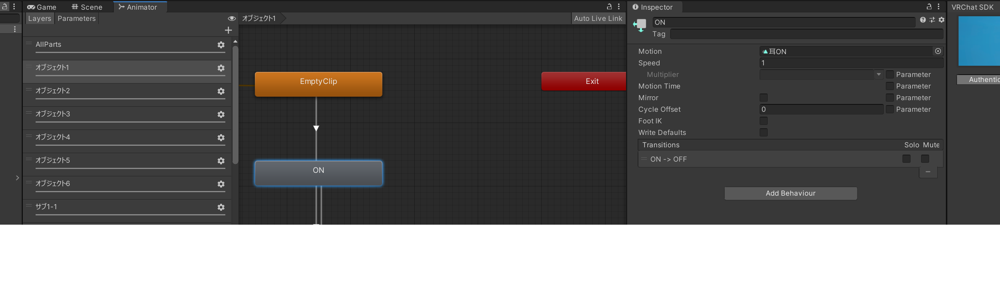
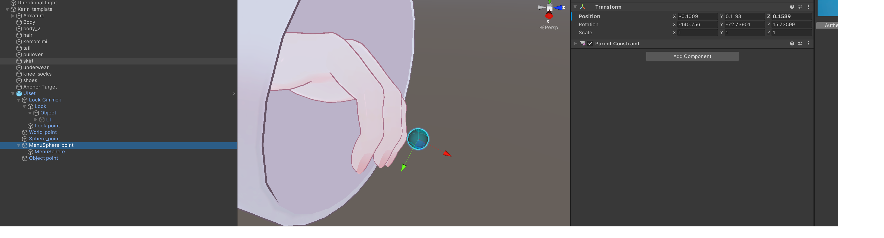
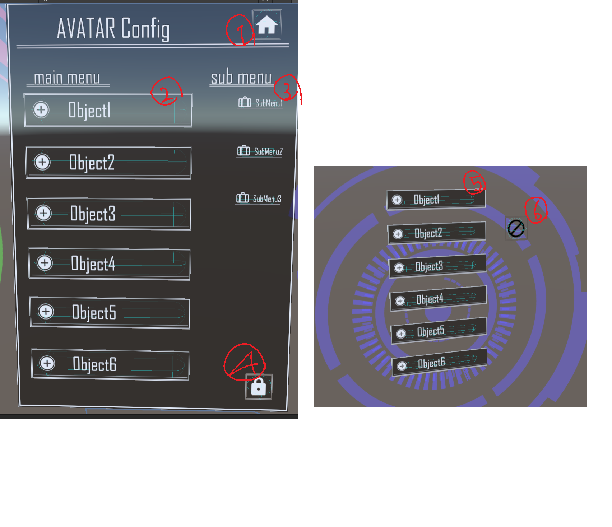
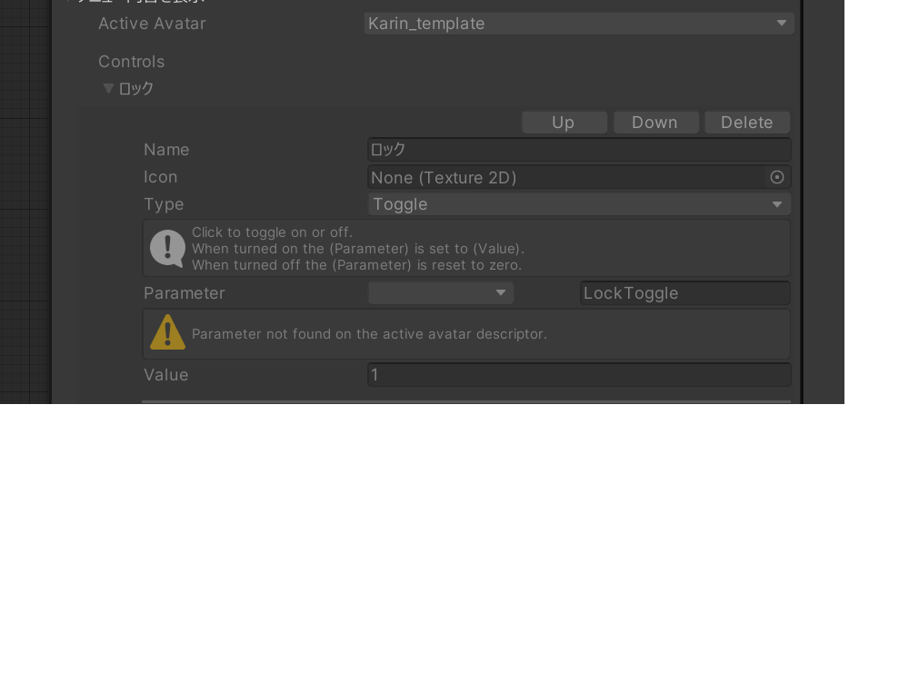

# 更新履歴

- 2022/12/3 ver1.0配布

## このツールの目的

UIsetはVRChatのcontact機能を利用したアニメーション補助ツールです

自分で作成した物の出し入れのアニメーションや、衣装の切り替えのアニメーションなどをcontactを使ってやってみたいけど設定がよくわからない、という方の導入の助けになることを目的としています

## 前提条件

オブジェクトONOFFアニメーションの作成ができる方と、アバターのアップロードができる方を対象としています

またこのツールは以下の2点のunityPackageの導入を前提としております

<a href="https://booth.pm/ja/items/3087170">lilToon</a>
<a href="https://modular-avatar.nadena.dev/ja/`">ModularAvatar</a>

<b>よって最新版のunitypackage版SDK、もしくはVCCでのprojectでないと導入ができません</b>

## 導入方法

1. 以下のリンクからlilToonとModularAvatarをダウンロードしてプロジェクトにインポートしてください
<a href="https://booth.pm/ja/items/3087170">lilToon</a>
<a href="https://modular-avatar.nadena.dev/ja/`">ModularAvatar</a>

2. UIset.unityPackageをプロジェクトにインポートしてください

3. Assetフォルダに有るUIsetフォルダ直下のUIset.prefabをアバター直下にドラッグアンドドロップします

4. UIFXを開き、使いたいレイヤーを選択します。レイヤーはprefabのオブジェクト名と対応しています

5.  レイヤー内のONに、ボタンを押したときにONにしたいアニメ OFFにボタンをもう一度押したときにOFFにしたいアニメを設定します。

6.  UIを非表示にします。

7. 左手にある青い球体があることを確認します

このとき左手に球体がない場合はSpere_pointのMABonePRoxyから、アバターの左手薬指の先のボーンを参照させてください

MenuSphere_pointの中にあるMenuSphereから位置を調整する事ができます

8.  メニューの中身は以下のようになっています

- ①閉じるボタン
- ②アニメーションONボタン（数字はレイヤーと対応
- ③サブメニューを開くボタン
- ④ロックボタン（ONにするとメニューを閉じた後に開かなくなるため、暴発防止に使ってください。ロックボタンはEXメニューにも追加されています

- ⑤サブメニューのアニメーションONボタン
    - サブメニューのアニメーションはすべてサブメニュー内でいずれか一つしか選択できないようになっています
      例えばサブメニュ1-1がONになっている状態で、サブメニュー1-2をONにするとサブメニュー1-1が自動的にOFFになります
      サブメニュー内をすべてOFFにしたいときは、ONになっているオブジェクトをもう一度タッチしてください
- ⑥サブメニューを閉じるボタン

- 後は自分で使いたいアニメーションを設定して、楽しんでみてください

## 使わせていただいたもの
- <a href="https://booth.pm/ja/items/1547585">満天星躑躅だよ様より【Unity】Parallax HUD Shader テクスチャ素材付き(ライセンス情報同梱済み)</a>
- <a href="https://booth.pm/ja/items/3087170">lilLab様より lilToon </a>
- <a href="https://modular-avatar.nadena.dev/ja/">bd_様より ModularAvatar </a>
- <a href="https://booth.pm/ja/items/2653422"> ないとまろうど様より Constraint式ワールド固定ギミック</a>