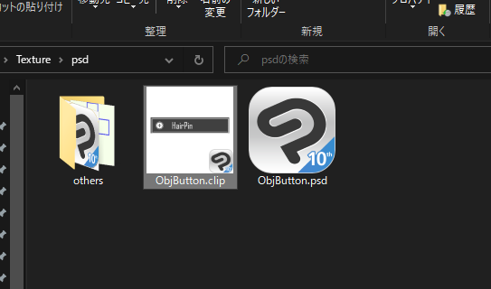

# 目次

- [目次](#目次)
  - [更新履歴](#更新履歴)
  - [このツールの目的](#このツールの目的)
  - [前提条件](#前提条件)
  - [導入の前に](#導入の前に)
    - [アニメーションの作成方法](#アニメーションの作成方法)
  - [導入方法](#導入方法)
  - [ボタンのテクスチャ改変について](#ボタンのテクスチャ改変について)
  - [他の人に触らせたくない or 特定の人だけ触らせたい](#他の人に触らせたくない-or-特定の人だけ触らせたい)
  - [使わせていただいたもの](#使わせていただいたもの)
  - [連絡先](#連絡先)
  - [注意事項](#注意事項)
  - [ライセンス情報](#ライセンス情報)

## 更新履歴

- 2022/12/03 ver1.0.0 配布

- 2022/12/09 ver2.0.0 配布

- 2022/12/10 ver2.1.0 配布
  - Lock時のボタンの色を赤から緑に変更して全体のUIを統一
  - メニュー出現時にアバターが横をむくとUIsetがブレるため修正
  - デフォルトの出現位置がアバターのhead依存だったのでspine依存に変更
  - boothに簡易的なセットアップ方法を追加
  - 桔梗ちゃんやカリンちゃんなど一部のアバターで導入した際に、初期表示で輝いてしまうので修正
  - 左利きの方用のprefabを追加
  - その他軽微なバグ修正

## このツールの目的

UIset は VRChat の contact 機能を利用したアニメーション補助ツールです

自分で作成した物の出し入れのアニメーションや衣装の切り替えのアニメーションなどを contact を使ってやってみたいけど設定がよくわからない、という方の導入の助けになることを目的としています

## 前提条件

オブジェクト ONOFF アニメーションの作成ができる方と、アバターのアップロードができる方を対象としています

またこのツールは以下の 2 点の unityPackage の導入を前提としております

<a href="https://booth.pm/ja/items/3087170">lilToon</a>

<a href="https://modular-avatar.nadena.dev/ja/">ModularAvatar</a>

<b>よって最新版の unitypackage 版 VRCSDK を導入しているプロジェクト、もしくは VCC で立ち上げているプロジェクトでないとアバターアップロード時に ModularAvatar でエラーが出てしまいます</b>

ご了承下さい

ModularAvatar を使用しない場合、<a href="https://booth.pm/ja/items/2207020">VRCAvatars3Tools</a>などを使用して、ツール付属のアニメーションを FXlayar などと統合する必要があります

こちらも動作は確認しておりますが解説記事は未定です

## 導入の前に

UIset に付属しているアニメーター UIFX は、アバターをルートとして作成しています

よって統合される側のアニメーターもアバターをルートとしている必要があります

アニメーションの作成方法がよくわからない方は、以下の手順を参考にしてみてください

### アニメーションの作成方法

1. アバターのアニメーターが none になっていることを確認します

2. 自分が管理しやすい場所で新規アニメーションを作成します

名前は empty としておくと後々管理しやすいと思います

3. アバターに作成した empty のアニメーションをドラッグします

4. このときアニメーションコントローラーが生成されます。ここに放り込んだアニメーションは基本的にアバターを起点として記録されるようになります

5. empty を押下した後、ctrl+D を押してコピーを作成し、xxxOFF のような名前に変更します。

   今回は薄荷ちゃんのヘッドホンを ONOFF するアニメーションを作成したいため、ヘッドホン OFF という名前にしてみます

6. ヘッドホン OFF をアバターにドラッグします

7. ヘッドホン OFF をダブルクリックし、animator を開きます

8. 次にアバターをクリックすると、セレクトボックスから記録されているアニメーションが選択できるようになります。

   ここではヘッドホン OFF を選びましょう

9. 赤い記録ボタンを押した後、アバター直下にあるヘッドホンオブジェクトからチェックを外します。

10. これでヘッドホンを消すアニメーションが完成です

11. ヘッドホン OFF を ctrl+D でクローンし、ヘッドホン ON というアニメーションを作成します

1.  すでにアニメーションが記録されているのでここではダブルクリックした後に、0 の部分を 1 に書き換えます

13. これでヘッドホンを消すアニメーションと表示させるアニメーションが完成しました。

    後は UIset を導入するときに遷移にセットするだけです

    それでは UIset を導入していきましょう

## 導入方法

1. 以下のリンクから lilToon と ModularAvatar をダウンロードしてプロジェクトにインポートしてください

   <a href="https://booth.pm/ja/items/3087170">lilToon</a>

   <a href="https://modular-avatar.nadena.dev/ja/`">ModularAvatar</a>

   

2. UIset.unityPackage をプロジェクトにインポートしてください

   

   

3. Asset フォルダに有る UIset フォルダ直下の UIset.prefab をアバター直下にドラッグアンドドロップします

   

   

4. UIFX を開き、使いたいレイヤーを選択します。

   
   レイヤーはprefabのオブジェクト名と対応しています
   

   

   サブメニューの場合は

   - SubMenu1Board の中の object1→ サブ 1-1
   - SubMenu2Board の中の object1→ サブ 2-1
   - SubMenu3Board の中の object1→ サブ 3-1
     のように対応しています

   

   

5. レイヤー内の ON に、ボタンを押したときに ON にしたいアニメ OFF にボタンをもう一度押したときに OFF にしたいアニメを設定します。
   

   

   今回はボタンを ON にしたときに薄荷ちゃんのヘッドホンを消したいため、ON にヘッドホン OFF、OFF にヘッドホン ON を設定しています

6. UI を非表示にします。
   

7. アバターの左手に青い球体があることを確認します
   

    このとき左手に球体がない場合は Spere_point の MABonePRoxy から、アバターの左手薬指の最後のボーンを参照させてください。

    カリンちゃんなどはボーン名が標準と異なるため、手動で設定する必要があります

    

    球体の位置を調整したい場合は、MenuSphere_point の中にある MenuSphere を移動させてください。

    

8.  メニューの中身は以下のようになっています

    

    - ① 閉じるボタン
    - ② アニメーション ON ボタン（数字はレイヤーと対応
    - ③ サブメニューを開くボタン
    - ④ ロックボタン - 暴発防止用ボタンです。ON にすると一旦メニューを閉じた後にメニューを開く判定が OFF になります - もう一度タッチするか、EXmenu から再度 OFF にすることが可能です
    

      

- ⑤ サブメニューのアニメーション ON ボタン

    - サブメニューのアニメーションはすべてサブメニュー内でいずれか一つしか選択できないようになっています
    例えばサブメニュ 1-1 が ON になっている状態で、サブメニュー 1-2 を ON にするとサブメニュー 1-1 が自動的に OFF になります
    サブメニュー内をすべて OFF にしたいときは、ON になっているオブジェクトをもう一度タッチしてください

    

    

    - ⑥ サブメニューを閉じるボタン

9. アバターをアップロードします

    

10. アバター左手に浮かんでいる球体を右手の人差し指でタッチするとメニューが出現します

    

    色々アニメーションを設定して遊んでみてください

## ボタンのテクスチャ改変について

  ボタン用のテクスチャをいくつかサンプルで同梱しております。

  基本的にはボタンごとにマテリアルが分かれているので、置き換えたいボタンのマテリアルに設定されているテクスチャを変えることで変更することができます

  

  

詳細な手順書は現在工事中です

## 他の人に触らせたくない or 特定の人だけ触らせたい

デフォルトではすべての判定が finger index(アバターの人差し指)に設定されています

他の人に触らせたくない場合は、allow ather のチェックボックスを外してください

 

 

  また、カスタムタグを設定し限られた人とだけ共有して設定してもらうことで、特定の人しか触れないボタン、などを実装することができます

 

 

 

 

 

 

  詳細な手順書は現在工事中です

## 使わせていただいたもの

- <a href="https://booth.pm/ja/items/1547585">満天星躑躅だよ様より【Unity】Parallax HUD Shader テクスチャ素材付き(ライセンス情報同梱済み)</a>
- <a href="https://booth.pm/ja/items/3087170">lilLab 様より lilToon </a>
- <a href="https://modular-avatar.nadena.dev/ja/">bd\_様より ModularAvatar </a>
- <a href="https://booth.pm/ja/items/2653422"> ないとまろうど様より Constraint 式ワールド固定ギミック</a>
- <a href='https://fonts.google.com/icons?selected=Material+Icons'>google Material Icons</a>

## 連絡先

不明な点や不具合は下記の SNS までご連絡するか issue を上げてくださって大丈夫です

<a href='https://twitter.com/hakononaka0001'>hakoiri</a>

## 注意事項

本ソフトウェアは hakoiri がその著作権を有しており、MIT ライセンスに基づいて提供します。

このソフトウェアは、自由に使用することができます。
このソフトウェアの著作権表示と、このライセンスの全文（英語の原文）を、ソースコードや、ソースコードに同梱したライセンス表示用の別ファイルなどに掲載してください。
このソフトウェアには保証はついていません。
このソフトウェアを利用したことで問題が起きた際に、ソフトウェアの製作者は一切の責任を負いません。

## ライセンス情報

MIT LICENCE
Copyright (c) 2022 hakoiri

Permission is hereby granted, free of charge, to any person obtaining a copy of this software and associated documentation files (the "Software"), to deal in the Software without restriction, including without limitation the rights to use, copy, modify, merge, publish, distribute, sublicense, and/or sell copies of the Software, and to permit persons to whom the Software is furnished to do so, subject to the following conditions:

The above copyright notice and this permission notice shall be included in all copies or substantial portions of the Software.

THE SOFTWARE IS PROVIDED "AS IS", WITHOUT WARRANTY OF ANY KIND, EXPRESS OR IMPLIED, INCLUDING BUT NOT LIMITED TO THE WARRANTIES OF MERCHANTABILITY, FITNESS FOR A PARTICULAR PURPOSE AND NONINFRINGEMENT. IN NO EVENT SHALL THE AUTHORS OR COPYRIGHT HOLDERS BE LIABLE FOR ANY CLAIM, DAMAGES OR OTHER LIABILITY, WHETHER IN AN ACTION OF CONTRACT, TORT OR OTHERWISE, ARISING FROM, OUT OF OR IN CONNECTION WITH THE SOFTWARE OR THE USE OR OTHER DEALINGS IN THE SOFTWARE.

MIT LICENCE
Copyright (c) 2019 Tsutsuji815
Permission is hereby granted, free of charge, to any person obtaining a copy of this software and associated documentation files (the "Software"), to deal in the Software without restriction, including without limitation the rights to use, copy, modify, merge, publish, distribute, sublicense, and/or sell copies of the Software, and to permit persons to whom the Software is furnished to do so, subject to the following conditions:

The above copyright notice and this permission notice shall be included in all copies or substantial portions of the Software.

THE SOFTWARE IS PROVIDED "AS IS", WITHOUT WARRANTY OF ANY KIND, EXPRESS OR IMPLIED, INCLUDING BUT NOT LIMITED TO THE WARRANTIES OF MERCHANTABILITY, FITNESS FOR A PARTICULAR PURPOSE AND NONINFRINGEMENT. IN NO EVENT SHALL THE AUTHORS OR COPYRIGHT HOLDERS BE LIABLE FOR ANY CLAIM, DAMAGES OR OTHER LIABILITY, WHETHER IN AN ACTION OF CONTRACT, TORT OR OTHERWISE, ARISING FROM, OUT OF OR IN CONNECTION WITH THE SOFTWARE OR THE USE OR OTHER DEALINGS IN THE SOFTWARE.

<a href='https://github.com/google/material-design-icons/blob/master/LICENSE'>Apache License 2.0</a>
